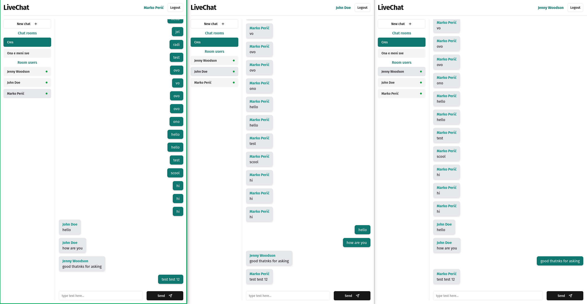
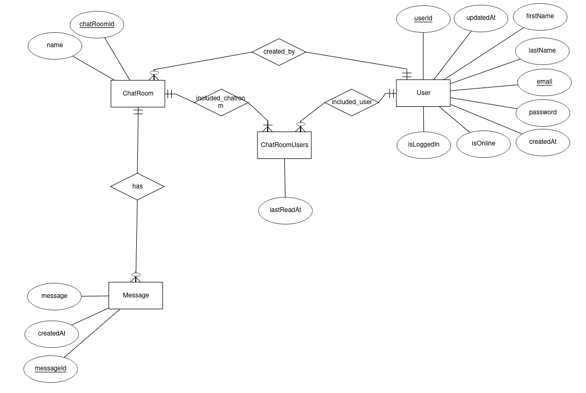

# LiveChat - Fullstack chat app

LiveChat is a fullstack web app built during my time as an intern at Cinnamon. Built with Node.js, Express, React and Typescript it enables users to chat and create custom chat rooms. All data is saved into a Postgres database and every component (backend, frontend, database) is dockerized and can be easily spun up with provided docker compose.

 Screenshot of livechat's frontend

# Description

Livechat uses sockets (Socket.IO) to handle realtime **communication**. The server doesn't store any messages it only serves as a distribute of events. Only information in server's memory is the mapping between user ids and sockerids so it can know where to send messages.

**Authentification** is done using JWT. Email verification and password resetting is implemented using an external email service called Resend that gives us an easy way to send emails using Node.

# Technologies used

- [React](https://react.dev/)
- [tailwindcss](https://tailwindcss.com/)
- [shadcn/ui](https://ui.shadcn.com/)
- [Node.js](https://nodejs.org/en)
- [Express](https://expressjs.com/)
- [PostgreSQL](https://www.postgresql.org/)
- [TypeScript](https://www.typescriptlang.org/)
- [TypeORM](https://typeorm.io/)
- [JWT](https://jwt.io/)
- [Docker](https://www.docker.com/)
- [Socker.IO](https://socket.io/)
- [Resend](https://resend.com/)

# What I've learned

While I've heard about all these technologies I've never actually used TypeORM nor Docker. Building a project with these technologies gave me a nice first hand experience with them. I found Docker fun and intuitive. While my project was small and Docker wasn't really needed I could immediately see its benefits and how it enables faster development, collaboration and deployment.

In second year of university we had a database course where we covered SQL and worked with Postgres. Now it was satifying using that knowledge to create my own model, relations and to query data. The missing key for me was how do you actually manage a database and how do you connect to it. This is where TypeORM came in and made that really simple. It was easy to pickup, create my models and get up and running. Offering full type safety and easy data querying it was a really powerful tool.

Working on a realtime system was challenging and really fun since it forced me to think differently about the standard Client - Server communication. Now the server can send messages and I needed to properly structure my events and data so that can be supported. As always thinking about speed and memory is important. In this project I thought about structuring my data in a way where the server only needs to send small updates about some object and not the whole object since the client already has that object it just needs to update relevant information.

# What I would improve

From the architectural side not much, it's more about technical details and how some parts could be optimized or improved. Here are some of things I would do a bit differently listed in order of my importance.

- **Authentification**

Current system is fine but it uses an access token which isn't regenerated during socket communication. When consuming standard REST endpoints the token is first checked and then regenerated, during socket communication the token is passed with every event so that user can be authorized but it isn't regenerated meaning that after the token expires you won't be able to communicate anymore and will have to login again. This leads to suboptimal UX and can be easily fixed by regenerating the token on every socket event or checking when will the token expire and if that duration is smaller then some threshold regenerate the token.

Current system could be improved by adding a reset token. That would increase security.

- **Token verification**

The above mentioned token verification during socket communication is not implemented. Being new to socket communication I didn't think of a way that someone could impersonate out socket connection, but I'm sure it can be done. Adding user verification with tokens will ensure that we know who is sending events and that they are valid.

- **Backend error handling**

Creating a better and more standardized error handling system would improve code readability, maintainability and it would make documentation easier since we could know the shape of the error at most time.

- **Password reset token invalidation**

When resetting a password you get a token that is short lived but can be used multiple times which I think is not optimal. Invalidating a password reset token after resetting a password will fix this.

## Possible features

- Adding nice api overview (swagger)
- Implementing an endpoint for sending a new email verification mail.
- Adding friends
- Deleting chat rooms
- Message replies
- _... i need to stop_

# Installation and setup instructions

Clone down this repository. You can run the project locally using `pnpm run dev` in both backend and frontend. For that you will need to setup your Postgres database locally.
Another option is to use docker and docker compose. That way you don't have to deal with manual building.

_Note: When using docker I'm not sure if postgres container will be functional since it might need a initial migration to setup database models. I didn't do that since I didn't have time and didn't really know how to do it at that moment. If you want to setup this project and need help feel free to contact me._

# Database entities and relations

Fairly simple structure behind this application. The ChatRoomUsers table connects users with chatrooms and stores the last time that a user read that room. This will allow us to display what messages are unread to the user when he logs in.

 Database ER Model
